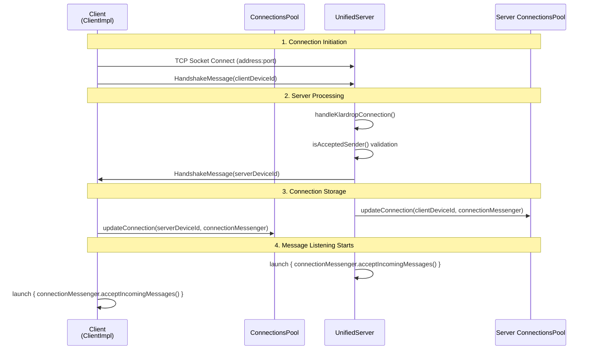
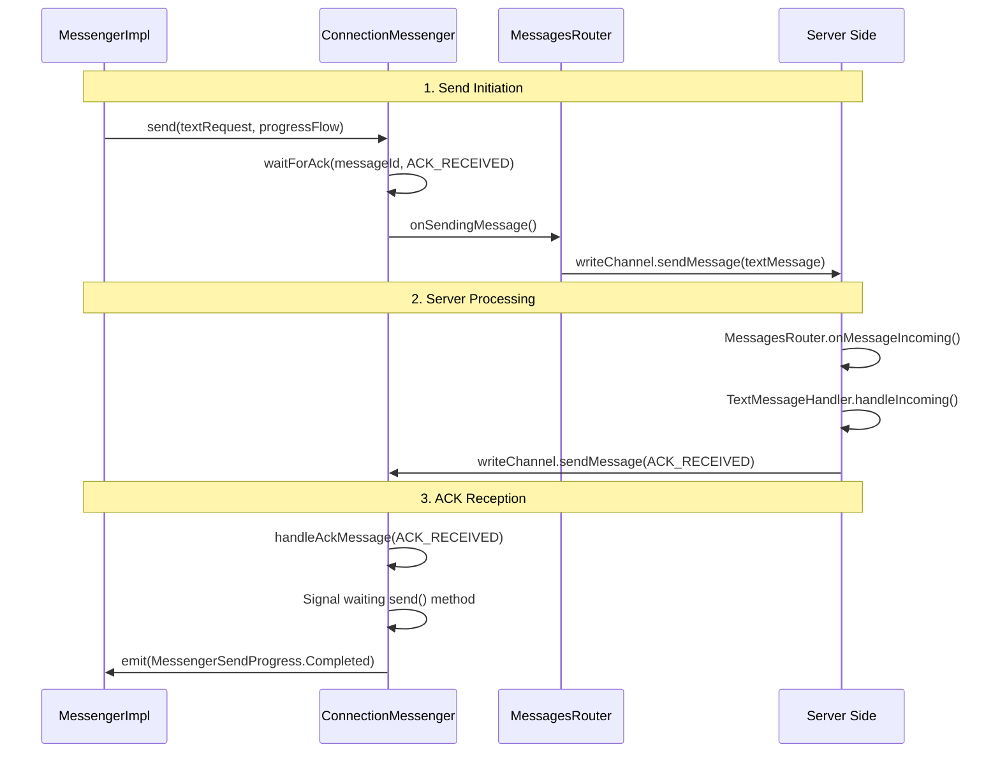
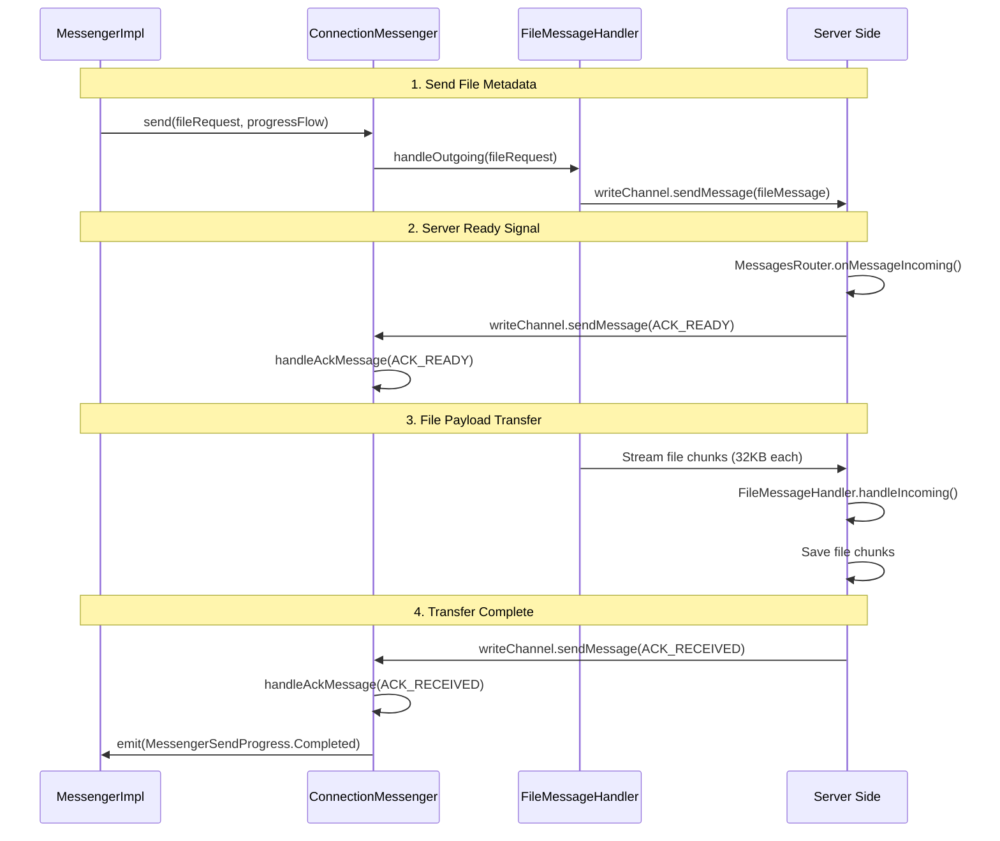

# Klardrop Protocol Documentation

This document explains the complete flow of the Klardrop protocol, including connection establishment, message transfer, acknowledgments, and status tracking.

## Table of Contents
- [Protocol Overview](#protocol-overview)
- [Connection Establishment](#connection-establishment)
- [Message Transfer Flow](#message-transfer-flow)
- [ACK (Acknowledgment) System](#ack-acknowledgment-system)
- [Status Tracking](#status-tracking)
- [Key Classes and Methods](#key-classes-and-methods)

## Protocol Overview

Klardrop uses a TCP socket-based protocol with length-prefixed messages and automatic acknowledgments for reliable message delivery.

### Message Format
```
[4-byte length (big-endian)][1-byte message type][protobuf payload]
```

### Message Types
| Type | ID | Description | Has Payload | ACK Flow |
|------|----|-------------|-------------|----------|
| `HANDSHAKE` | 0 | Device identification during connection setup | No | None |
| `TEXT` | 1 | Text message sharing | No | ACK_RECEIVED |
| `FILE` | 2 | File metadata and transfer | Yes | ACK_READY + ACK_RECEIVED |
| `ACK_READY` | 3 | Acknowledgment: ready to receive payload | No | None |
| `ACK_RECEIVED` | 4 | Acknowledgment: message/payload received | No | None |

## Transports

Klardrop is **transport-agnostic**: the same Klardrop wire format
(`[4-byte length][1-byte type][protobuf payload]`) flows over any of the
available media. Discovery and transfer can use any combination, and `Client`
picks the best transport per connection.

| Transport | Discovery | Used for transfer when… | Speed |
|---|---|---|---|
| **Klardrop TCP** (mDNS `_klardrop._tcp.`) | jmDNS / NSD | Both peers on the same Wi-Fi LAN | Fast |
| **Nearby Share TCP** (mDNS `_FC9F5ED42C8A._tcp.`) | jmDNS / NSD | Cross-app interop (e.g., Google Quick Share) | Fast |
| **Bluetooth Low Energy (BLE)** | Service-UUID scan | Wi-Fi unreachable; falls back to BLE GATT | Slow (≤ ~244-byte chunks) |

### Bluetooth as a fallback medium

BLE is treated as **one more transport in the discovery list**, not a
replacement. It only gets used for transfers when no Wi-Fi-based path is
available, because BLE GATT is significantly slower than TCP over Wi-Fi.

How it works:

- **Discovery**: every Klardrop instance simultaneously *advertises* a
  well-known service UUID (`a5b7c3e1-7f5a-4b62-9a3c-1d8e2f4b6c8a`) and *scans*
  for other devices broadcasting the same UUID. The advertisement carries the
  device's `shortDeviceId` (8 hex chars, the same id used in mDNS service
  names) in **scan-response service-data** so peers can match it without
  opening a connection. The friendly name / OS / device-type are intentionally
  *not* in the advertisement (it's public airwaves) — they're delivered later
  via the encrypted Klardrop handshake.
- **Eager handshake**: as soon as a BLE peer is discovered, the side picked by
  `BleRoleSelector` (the device with the lexicographically smaller short id)
  opens a quick GATT session, exchanges a `HandshakeMessage` carrying
  `(deviceId, deviceName, osType, deviceType)`, and the peer's `VisibleDevices`
  entry gets enriched. The session stays in the connection pool so subsequent
  user-initiated transfers reuse it.
- **GATT service**: a single primary service exposes two characteristics — TX
  (write-with-response, central → server) and RX (notifications,
  server → client). Both carry the same length-prefixed Klardrop wire format,
  reassembled across MTU-sized chunks (`BleFraming` / `BleReassembler`).
- **Platform implementations**: Android uses `BluetoothLeAdvertiser` /
  `BluetoothGattServer`. iOS / macOS use CoreBluetooth (`CBPeripheralManager` /
  `CBCentralManager`). The macOS desktop JVM build delegates to a small Swift
  helper subprocess (`klardrop-ble-helper`) because the JVM has no direct
  CoreBluetooth bindings; the helper speaks newline-delimited JSON over
  stdin/stdout.
- **Permissions**: Android requires the BLUETOOTH_SCAN, BLUETOOTH_ADVERTISE,
  and BLUETOOTH_CONNECT runtime permissions on API 31+. macOS bundles request
  Bluetooth via `NSBluetoothAlwaysUsageDescription` in Info.plist. iOS already
  has the same plist key.

The wire-format decision (which AD record types carry the service UUID vs the
short device id) is centralised in `BleAdvertisePayload.kt` and unit-tested in
`BleAdvertisePayloadTest` so this can't silently regress.

## Connection Establishment

### Sequence Diagram


### Detailed Flow

#### 1. Client Initiates Connection
**Method:** `ClientImpl.connectTo(deviceId: String)`
- Location: `common/src/commonMain/kotlin/com/carlom/klardrop/common/communication/Client.kt:37`
- Checks if connection already exists via `connectionsPool.isAvailable(deviceId)`
- Gets device info from `VisibleDevices`
- Calls `establishConnection()` for each available address/port

#### 2. TCP Socket Establishment
**Method:** `ClientImpl.establishConnection(address, port, deviceId, connectionJob)`
- Location: `common/src/commonMain/kotlin/com/carlom/klardrop/common/communication/Client.kt:82`
- Creates TCP socket: `aSocket(selectorManager).tcp().connect(address, port)`
- Opens read/write channels
- Sends handshake: `writeChannel.sendMessage(handshakeMessage, serializer)`

#### 3. Server Accepts Connection
**Method:** `UnifiedServer.handleKlardropConnection()`
- Location: `common/src/commonMain/kotlin/com/carlom/klardrop/common/communication/UnifiedServer.kt:200`
- Validates sender with `isAcceptedSender()`
- Creates `ConnectionMessenger` instance
- Stores connection: `connectionsPool.updateConnection(deviceId, connectionMessenger)`
- Sends handshake response
- Starts listening: `serverScope.launch { connectionMessenger.acceptIncomingMessages() }`

#### 4. Client Completes Connection
**Method:** `ClientImpl.establishConnection()` (continued)
- Receives server handshake response
- Validates server device ID
- Creates client-side `ConnectionMessenger`
- Stores connection: `connectionsPool.updateConnection(deviceId, connectionMessenger)`
- Starts listening: `clientScope.launch { connectionMessenger.acceptIncomingMessages() }`

## Message Transfer Flow

### Text Message Transfer (No Payload)



### File Message Transfer (With Payload)



## ACK (Acknowledgment) System

### Purpose
The ACK system ensures reliable message delivery by:
- Confirming message reception
- Detecting connection drops
- Enabling automatic retry with connection recovery

### ACK Types

#### ACK_READY (Type 3)
- **When:** Sent by server before processing payload messages (FILE)
- **Purpose:** Indicates server is ready to receive file data
- **Flow:** Client waits for ACK_READY before sending file payload

#### ACK_RECEIVED (Type 4)
- **When:** Sent by server after successfully processing any message
- **Purpose:** Confirms message was received and processed
- **Flow:** Client waits for ACK_RECEIVED to complete transfer

### ACK Implementation Details

#### Server-Side ACK Generation
**Location:** `MessagesRouterImpl.onMessageIncoming()`
- Path: `common/src/commonMain/kotlin/com/carlom/klardrop/common/communication/router/MessagesRouter.kt:43`

```kotlin
// For payload messages (FILE): Send ACK_READY before processing
if (message.hasPayload && !isAckMessage) {
    val ackReady = MessageAcknowledgment(AckType.READY, message.id)
    writeChannel.sendMessage(ackReady, messageSerializer)
}

// Process message through appropriate handler
messageHandler.handleIncoming(message, readChannel, receiveFlow)

// Send ACK_RECEIVED after successful processing
if (!isAckMessage) {
    val ackReceived = MessageAcknowledgment(AckType.RECEIVED, message.id)
    writeChannel.sendMessage(ackReceived, messageSerializer)
}
```

#### Client-Side ACK Waiting
**Location:** `ConnectionMessenger.send()`
- Path: `common/src/commonMain/kotlin/com/carlom/klardrop/common/communication/ConnectionMessenger.kt:98`

```kotlin
if (message.hasPayload) {
    // Send message metadata through router
    messagesRouter.onSendingMessage(...)
    // Wait for ACK_RECEIVED (handler manages payload internally)
    waitForAck(message.id, AckType.RECEIVED)
} else {
    // Send message through router
    messagesRouter.onSendingMessage(...)
    // Wait for ACK_RECEIVED
    waitForAck(message.id, AckType.RECEIVED)
}
```

#### ACK Correlation System
**Location:** `ConnectionMessenger`
- Uses `pendingAcks: MutableMap<Int, PendingAck>` to track expected ACKs
- `waitForAck()` creates Channel and waits with 10-second timeout
- `handleAckMessage()` matches received ACKs by message ID and signals waiting threads

### ACK Timeout and Recovery
**Location:** `MessengerImpl.handleKlardropTransfer()`
- Path: `common/src/commonMain/kotlin/com/carlom/klardrop/common/communication/Messenger.kt:103`

```kotlin
// Retry logic with exponential backoff
while (attempt <= maxRetries) {
    try {
        connectionMessenger.send(messageRequest, flow) // May throw ACK timeout
        return true
    } catch (exception) {
        if (exception.message?.contains("ACK timeout") && attempt <= maxRetries) {
            connectionsPool.closeConnection(deviceId) // Force cleanup
            delay(exponentialBackoffDelay) // Wait before retry
        }
    }
}
```

## Status Tracking

### MessengerSendProgress States

The transfer status is tracked through `MessengerSendProgress` sealed interface:

```kotlin
sealed interface MessengerSendProgress {
    data object Pending : MessengerSendProgress
    data class InProgress(val percentage: Int) : MessengerSendProgress  
    data object Completed : MessengerSendProgress
    data class Error(val message: String) : MessengerSendProgress
}
```

### Status Flow Sequence

#### 1. Transfer Initiation
**Location:** `MessengerImpl.send()`
```kotlin
flow.emit(Pending) // Initial state
```

#### 2. Connection Establishment
**Location:** `MessengerImpl.getOrEstablishConnection()`
- Uses existing connection if available and open
- Creates new connection if needed via `client.connectTo(deviceId)`

#### 3. Message Sending Progress
**Location:** `FileMessageHandler.handleOutgoing()` (for files)
```kotlin
// During file upload
flow.emit(InProgress(percentage)) // Progress updates every 32KB chunk
```

#### 4. ACK Waiting
**Location:** `ConnectionMessenger.send()`
- Waits for appropriate ACKs (ACK_READY for files, ACK_RECEIVED for all)
- On timeout: throws exception → triggers retry logic

#### 5. Transfer Completion
**Location:** `ConnectionMessenger.send()`
```kotlin
flow.emit(MessengerSendProgress.Completed) // Success
// OR
flow.emit(MessengerSendProgress.Error("...")) // Failure
```

### Receive Status Tracking

Message reception is tracked through `ReceiveMessageUpdate`:

```kotlin
data class ReceiveMessageUpdate(
    val messages: List<Message> = emptyList(),
    val status: ReceiveMessageStatus,
    val progress: Float = 0f
)

sealed interface ReceiveMessageStatus {
    data object Pending : ReceiveMessageStatus
    data class InProgress(val percentage: Int) : ReceiveMessageStatus
    data object Completed : ReceiveMessageStatus
    data object Error : ReceiveMessageStatus
}
```

## Key Classes and Methods

### Core Communication Classes

#### MessengerImpl
- **Purpose:** High-level message sending interface
- **Location:** `common/src/commonMain/kotlin/com/carlom/klardrop/common/communication/Messenger.kt:29`
- **Key Methods:**
  - `send(deviceId, messageRequest): Flow<MessengerSendProgress>`
  - `handleKlardropTransfer()` - Retry logic with connection recovery
  - `getOrEstablishConnection()` - Connection management

#### ConnectionMessenger
- **Purpose:** Manages individual socket connections and ACK correlation
- **Location:** `common/src/commonMain/kotlin/com/carlom/klardrop/common/communication/ConnectionMessenger.kt:19`
- **Key Methods:**
  - `send(sendRequest, flow)` - Send message and wait for ACKs
  - `acceptIncomingMessages()` - Message listening loop
  - `handleAckMessage(ack)` - ACK correlation and signaling
  - `waitForAck(messageId, ackType)` - ACK waiting with timeout

#### MessagesRouterImpl
- **Purpose:** Routes messages to appropriate handlers and generates ACKs
- **Location:** `common/src/commonMain/kotlin/com/carlom/klardrop/common/communication/router/MessagesRouter.kt:37`
- **Key Methods:**
  - `onMessageIncoming()` - Process incoming messages and send ACKs
  - `onSendingMessage()` - Route outgoing messages to handlers

#### UnifiedServer
- **Purpose:** Accept connections and detect protocol type
- **Location:** `common/src/commonMain/kotlin/com/carlom/klardrop/common/communication/UnifiedServer.kt:80`
- **Key Methods:**
  - `startServer()` - Start listening for connections
  - `handleKlardropConnection()` - Process Klardrop protocol connections

#### ClientImpl
- **Purpose:** Establish outgoing connections
- **Location:** `common/src/commonMain/kotlin/com/carlom/klardrop/common/communication/Client.kt:22`
- **Key Methods:**
  - `connectTo(deviceId)` - Initiate connection to remote device
  - `establishConnection()` - TCP socket setup and handshake

### Message Handling Classes

#### TextMessageHandler
- **Purpose:** Handle text message sending/receiving
- **Location:** `common/src/commonMain/kotlin/com/carlom/klardrop/common/communication/message/TextMessageHandler.kt`

#### FileMessageHandler  
- **Purpose:** Handle file transfer with chunked streaming
- **Location:** `common/src/commonMain/kotlin/com/carlom/klardrop/common/communication/message/FileMessage.kt:46`
- **Key Methods:**
  - `handleOutgoing()` - Send file metadata and stream payload
  - `handleIncoming()` - Receive file metadata and payload chunks

#### AckMessageHandler
- **Purpose:** Handle ACK message processing (minimal implementation)
- **Location:** `common/src/commonMain/kotlin/com/carlom/klardrop/common/communication/message/AckMessage.kt:10`

### Support Classes

#### ConnectionsPool
- **Purpose:** Manage active connections per device
- **Location:** `common/src/commonMain/kotlin/com/carlom/klardrop/common/communication/ConnectionsPool.kt`

#### MessageSerializer
- **Purpose:** Serialize/deserialize Protocol Buffer messages
- **Location:** `common/src/commonMain/kotlin/com/carlom/klardrop/common/communication/MessageSerializer.kt`

#### VisibleDevices
- **Purpose:** Track discovered devices and their connection info
- **Location:** `common/src/commonMain/kotlin/com/carlom/klardrop/common/discovery/VisibleDevices.kt`

## Message Listening Loops

### Server-Side Listening
**Where:** `UnifiedServer.handleKlardropConnection()`
```kotlin
serverScope.launch {
    connectionMessenger.acceptIncomingMessages() // Continuous loop
}
```

### Client-Side Listening  
**Where:** `ClientImpl.establishConnection()`
```kotlin
clientScope.launch {
    connectionMessenger.acceptIncomingMessages() // Continuous loop  
}
```

### Message Processing Loop
**Where:** `ConnectionMessenger.acceptIncomingMessages()`
```kotlin
while (!readChannel.isClosedForRead) {
    messagesRouter.onMessageIncoming(deviceId, writeChannel, readChannel) { ack ->
        handleAckMessage(ack) // ACK correlation
    }
}
```

This continuous loop:
1. Reads incoming messages from the socket
2. Routes non-ACK messages to appropriate handlers
3. Handles ACK messages through correlation system
4. Automatically generates ACK responses (server-side)
5. Continues until connection is closed

The beauty of this design is that both client and server run identical message listening loops, with the only difference being that servers automatically generate ACKs while clients correlate received ACKs with pending sends.