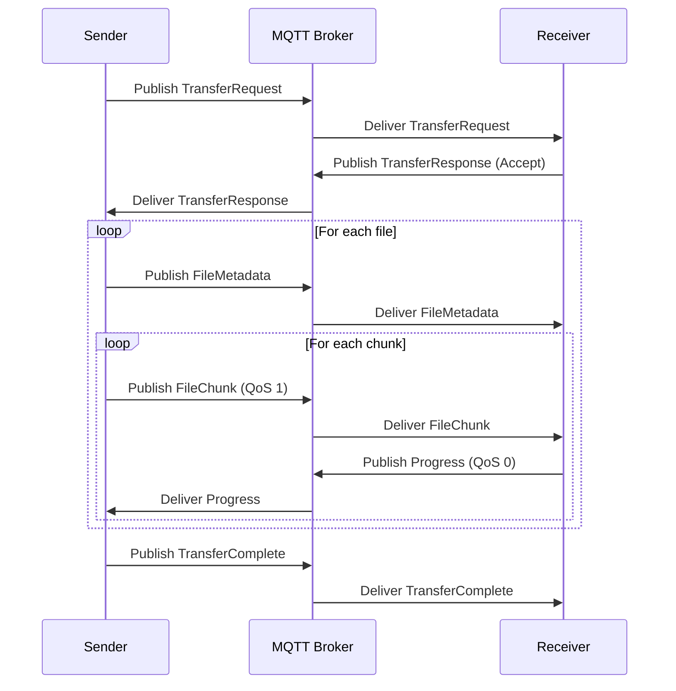

# MQTT-Based Cloud Architecture for Klardrop File Transfer System

## Executive Summary

This document outlines a comprehensive MQTT-based cloud architecture for extending Klardrop's file transfer capabilities beyond local networks. The design integrates seamlessly with the existing TCP socket-based architecture while providing global connectivity through MQTT brokers.

## Architecture Overview

### Core Design Principles

1. **Protocol Compatibility**: Maintain compatibility with existing Klardrop and Nearby Share protocols
2. **Hybrid Operation**: Support both local (mDNS/TCP) and cloud (MQTT) discovery and transfer
3. **Efficiency**: Optimize for large file transfers using chunked streaming
4. **Security**: End-to-end encryption with device authentication
5. **Scalability**: Support thousands of concurrent connections and transfers

### High-Level Architecture

```
┌─────────────────┐         ┌─────────────────┐
│   Device A      │         │   Device B      │
│  (Klardrop)     │         │  (Klardrop)     │
├─────────────────┤         ├─────────────────┤
│ Local Discovery │         │ Local Discovery │
│   (mDNS/TCP)    │         │   (mDNS/TCP)    │
├─────────────────┤         ├─────────────────┤
│ Cloud Discovery │         │ Cloud Discovery │
│   (MQTT)        │         │   (MQTT)        │
└────────┬────────┘         └────────┬────────┘
         │                           │
         └──────────┬────────────────┘
                    │
                    ▼
         ┌──────────────────────┐
         │   MQTT Broker Cloud  │
         │   (HiveMQ/EMQX)      │
         ├──────────────────────┤
         │ - Device Registry    │
         │ - Message Routing    │
         │ - File Chunk Relay   │
         │ - Presence Tracking  │
         └──────────────────────┘
```

## MQTT Broker Selection

### Recommended: HiveMQ Cloud

**Advantages:**
- Native Kotlin/Java SDK support
- Built-in clustering and high availability
- WebSocket support for browser clients
- Comprehensive monitoring and analytics
- MQTT 5.0 support with shared subscriptions
- Enterprise-grade security features

**Alternative: EMQX**
- Open-source with cloud offering
- Excellent performance for high-throughput scenarios
- Rule engine for message processing
- Multi-protocol support (MQTT, CoAP, LwM2M)

### Broker Configuration

```kotlin
// HiveMQ Client Configuration
data class MqttBrokerConfig(
    val host: String = "broker.hivemq.cloud",
    val port: Int = 8883, // TLS
    val username: String,
    val password: String,
    val clientId: String, // Device-specific ID
    val keepAlive: Int = 60,
    val cleanSession: Boolean = false,
    val mqttVersion: MqttVersion = MqttVersion.MQTT_5_0
)
```

## Topic Structure

### Hierarchical Topic Design

```
klardrop/
├── presence/
│   └── {device_id}                    # Device online status
├── discovery/
│   ├── announce/{device_id}           # Device announcements
│   └── query/{query_id}               # Discovery queries
├── transfer/
│   ├── request/{sender_id}/{receiver_id}/{transfer_id}
│   ├── response/{receiver_id}/{sender_id}/{transfer_id}
│   ├── metadata/{sender_id}/{receiver_id}/{transfer_id}
│   └── chunks/{sender_id}/{receiver_id}/{transfer_id}/{chunk_id}
├── control/
│   ├── pause/{transfer_id}
│   ├── resume/{transfer_id}
│   └── cancel/{transfer_id}
└── system/
    ├── stats/{device_id}
    └── errors/{device_id}
```

### Topic Naming Conventions

- Use lowercase with underscores for multi-word segments
- Include device IDs for routing and security
- Transfer IDs are UUIDs for uniqueness
- Chunk IDs are sequential integers with zero-padding

## Message Payload Formats

### Protocol Buffer Definitions

```protobuf
// mqtt_messages.proto
syntax = "proto3";

package klardrop.mqtt;

// Device presence message
message DevicePresence {
  string device_id = 1;
  string device_name = 2;
  DeviceCapabilities capabilities = 3;
  int64 timestamp = 4;
  repeated string supported_protocols = 5; // ["klardrop", "nearby_share"]
}

message DeviceCapabilities {
  int64 max_file_size = 1;
  repeated string supported_file_types = 2;
  int32 max_concurrent_transfers = 3;
  bool supports_resume = 4;
  bool supports_encryption = 5;
}

// File transfer messages
message TransferRequest {
  string transfer_id = 1;
  string sender_id = 2;
  string receiver_id = 3;
  repeated FileMetadata files = 4;
  TransferOptions options = 5;
}

message TransferOptions {
  bool encrypt = 1;
  bool compress = 2;
  int32 chunk_size = 3; // bytes, default 65536 (64KB)
  int32 parallel_chunks = 4; // number of chunks to send in parallel
}

message TransferResponse {
  string transfer_id = 1;
  TransferStatus status = 2;
  string message = 3;
  repeated string accepted_file_ids = 4;
}

enum TransferStatus {
  ACCEPTED = 0;
  REJECTED = 1;
  PARTIAL_ACCEPT = 2;
  NO_SPACE = 3;
  UNSUPPORTED = 4;
}

message FileChunk {
  string transfer_id = 1;
  string file_id = 2;
  int32 chunk_index = 3;
  int32 total_chunks = 4;
  bytes data = 5;
  string checksum = 6; // SHA-256 of chunk
}

message TransferProgress {
  string transfer_id = 1;
  string file_id = 2;
  int64 bytes_transferred = 3;
  int64 total_bytes = 4;
  float speed_mbps = 5;
  int32 chunks_completed = 6;
  int32 total_chunks = 7;
}
```

## QoS Levels Strategy

### QoS Level Assignment

| Message Type | QoS Level | Rationale |
|-------------|-----------|-----------|
| Device Presence | 0 | Frequent updates, loss acceptable |
| Discovery Announce | 1 | Important but can be retried |
| Transfer Request | 2 | Must be delivered exactly once |
| Transfer Response | 2 | Critical for handshake |
| File Metadata | 2 | Required for transfer setup |
| File Chunks | 1 | Can be retransmitted if needed |
| Progress Updates | 0 | Informational only |
| Control Commands | 2 | Must be executed exactly once |

## Connection Management

### Connection Strategy

```kotlin
class MqttConnectionManager(
    private val config: MqttBrokerConfig,
    private val coroutines: Coroutines
) {
    private val reconnectDelay = ExponentialBackoff(
        initialDelay = 1000L,
        maxDelay = 60000L,
        multiplier = 2.0
    )
    
    private val mqttClient = MqttClient.builder()
        .identifier(config.clientId)
        .serverHost(config.host)
        .serverPort(config.port)
        .sslWithDefaultConfig()
        .automaticReconnect()
            .initialDelay(reconnectDelay.initialDelay, TimeUnit.MILLISECONDS)
            .maxDelay(reconnectDelay.maxDelay, TimeUnit.MILLISECONDS)
            .applyAutomaticReconnect()
        .addConnectedListener { 
            publishPresence()
            resubscribeToTopics()
        }
        .addDisconnectedListener { 
            handleDisconnection()
        }
        .build()
        
    suspend fun connect() {
        mqttClient.connectWith()
            .cleanStart(config.cleanSession)
            .keepAlive(config.keepAlive)
            .sessionExpiryInterval(3600) // 1 hour
            .send()
            .await()
    }
}
```

### Reconnection Strategy

1. **Exponential Backoff**: Start with 1s, double up to 60s max
2. **Session Persistence**: Maintain subscriptions across reconnects
3. **Message Queuing**: Buffer messages during disconnection
4. **Presence Recovery**: Re-announce device on reconnection
5. **Transfer Resume**: Continue interrupted transfers

## File Transfer Protocol

### Transfer Flow



### Large File Handling

```kotlin
class MqttFileTransferManager {
    companion object {
        const val DEFAULT_CHUNK_SIZE = 65536 // 64KB
        const val MAX_CHUNK_SIZE = 262144 // 256KB
        const val PARALLEL_CHUNKS = 4
    }
    
    suspend fun sendFile(
        file: File,
        receiverId: String,
        transferId: String
    ) = coroutineScope {
        val chunks = file.splitIntoChunks(DEFAULT_CHUNK_SIZE)
        val semaphore = Semaphore(PARALLEL_CHUNKS)
        
        chunks.mapIndexed { index, chunk ->
            async {
                semaphore.withPermit {
                    sendChunk(
                        transferId = transferId,
                        fileId = file.id,
                        chunkIndex = index,
                        totalChunks = chunks.size,
                        data = chunk,
                        checksum = chunk.sha256()
                    )
                }
            }
        }.awaitAll()
    }
}
```

## Performance Optimization

### 1. Message Compression

```kotlin
// Enable MQTT 5.0 payload compression
client.publishWith()
    .topic("klardrop/transfer/chunks/...")
    .payload(compressChunk(fileChunk))
    .contentType("application/protobuf+gzip")
    .payloadFormatIndicator(PayloadFormatIndicator.BINARY)
    .send()
```

### 2. Shared Subscriptions (MQTT 5.0)

```kotlin
// Load balance file chunks across multiple client instances
client.subscribeWith()
    .topicFilter("$share/transfer-group/klardrop/transfer/chunks/+/+/+/+")
    .qos(MqttQos.AT_LEAST_ONCE)
    .send()
```

### 3. Topic Aliases

```kotlin
// Reduce bandwidth for frequently used topics
val topicAliasMapping = mapOf(
    1 to "klardrop/transfer/chunks",
    2 to "klardrop/transfer/progress",
    3 to "klardrop/presence"
)
```

### 4. Chunking Strategy

- Adaptive chunk size based on network conditions
- Parallel chunk transmission with flow control
- Chunk-level checksums for integrity
- Resume capability with chunk tracking

## Scalability Considerations

### 1. Broker Clustering

```yaml
# HiveMQ cluster configuration
cluster:
  enabled: true
  transport:
    type: tcp
  discovery:
    type: kubernetes
  replication:
    factor: 3
```

### 2. Load Distribution

- **Geographic Distribution**: Deploy brokers in multiple regions
- **Device Sharding**: Assign devices to brokers based on ID hash
- **Transfer Routing**: Direct transfers through nearest broker
- **Bandwidth Throttling**: Implement per-device rate limits

### 3. Resource Management

```kotlin
class MqttResourceManager {
    private val activeTransfers = ConcurrentHashMap<String, TransferSession>()
    private val maxConcurrentTransfers = 10
    private val maxBandwidthMbps = 100
    
    fun canAcceptTransfer(): Boolean {
        return activeTransfers.size < maxConcurrentTransfers &&
               getCurrentBandwidthUsage() < maxBandwidthMbps
    }
}
```

## Integration with Klardrop

### 1. Extended UnifiedServer

```kotlin
class ExtendedUnifiedServer(
    // Existing dependencies
    private val mqttConnectionManager: MqttConnectionManager
) : Server(...) {
    
    override suspend fun startServer(): ServerConfig {
        val config = super.startServer()
        
        // Start MQTT connection in parallel
        coroutineScope.launch {
            mqttConnectionManager.connect()
            mqttConnectionManager.announceDevice(config.port)
        }
        
        return config
    }
}
```

### 2. Hybrid Discovery

```kotlin
class HybridDiscoveryNetwork(
    // Existing dependencies
    private val mqttDiscovery: MqttDiscoveryService
) : DiscoveryNetwork(...) {
    
    fun startCloudDiscovery() {
        discoveryScope.launch {
            // Local discovery continues as normal
            super.discoveryKlardropDevices()
            
            // Add cloud discovery
            mqttDiscovery.startDiscovery { cloudDevice ->
                visibleDevices.addCloudDevice(cloudDevice)
            }
        }
    }
}
```

### 3. Protocol Selection

```kotlin
enum class TransferProtocol {
    LOCAL_TCP,      // Direct TCP connection (existing)
    CLOUD_MQTT,     // MQTT relay
    HYBRID          // Start local, fallback to cloud
}

class SmartTransferManager {
    suspend fun initiateTransfer(
        deviceId: String,
        files: List<File>
    ) {
        val device = visibleDevices.getDevice(deviceId)
        
        when {
            device.isLocal -> useLocalTransfer(device, files)
            device.isCloud -> useCloudTransfer(device, files)
            else -> useHybridTransfer(device, files)
        }
    }
}
```

## Security Considerations

### 1. Device Authentication

```kotlin
// Device certificate-based authentication
val deviceCertificate = generateDeviceCertificate(deviceId)
mqttClient.connectWith()
    .simpleAuth()
        .username(deviceId)
        .password(deviceCertificate.sign(challenge))
    .send()
```

### 2. End-to-End Encryption

```kotlin
// File chunk encryption
val encryptedChunk = FileChunk.newBuilder()
    .setData(ByteString.copyFrom(
        encryptWithDeviceKey(chunk.data, receiverPublicKey)
    ))
    .build()
```

### 3. Access Control

- Topic-based ACLs per device
- Transfer authorization tokens
- Rate limiting per device/IP
- Audit logging for transfers

## Implementation Roadmap

### Phase 1: Core MQTT Integration (Week 1-2)
- Set up HiveMQ client
- Implement basic connection management
- Create Protocol Buffer definitions
- Add device presence functionality

### Phase 2: Discovery & Handshake (Week 3-4)
- Implement MQTT discovery service
- Integrate with existing VisibleDevices
- Add cloud device detection
- Create transfer negotiation protocol

### Phase 3: File Transfer (Week 5-6)
- Implement chunked file transfer
- Add progress tracking
- Create transfer management UI
- Implement error handling

### Phase 4: Optimization & Testing (Week 7-8)
- Add compression support
- Implement resume capability
- Performance testing
- Scale testing with multiple devices

## Monitoring & Observability

### Metrics to Track

```kotlin
data class TransferMetrics(
    val transferId: String,
    val startTime: Long,
    val bytesTransferred: Long,
    val averageSpeed: Double,
    val retransmissions: Int,
    val errors: List<TransferError>
)

// Publish metrics to monitoring topic
mqttClient.publishWith()
    .topic("klardrop/system/stats/${deviceId}")
    .payload(metrics.toProtobuf())
    .qos(MqttQos.AT_MOST_ONCE)
    .send()
```

### Health Checks

- Broker connectivity status
- Transfer success rate
- Average transfer speed
- Device online/offline events
- Error rates by type

## Conclusion

This MQTT-based architecture extends Klardrop's capabilities to support global file transfers while maintaining compatibility with the existing local transfer mechanisms. The design prioritizes efficiency, scalability, and seamless integration with the current codebase. The use of Protocol Buffers ensures consistency with the existing wire format, while MQTT provides a robust foundation for cloud-based communication.