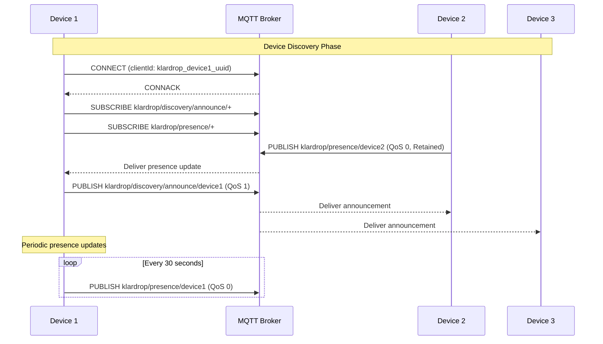
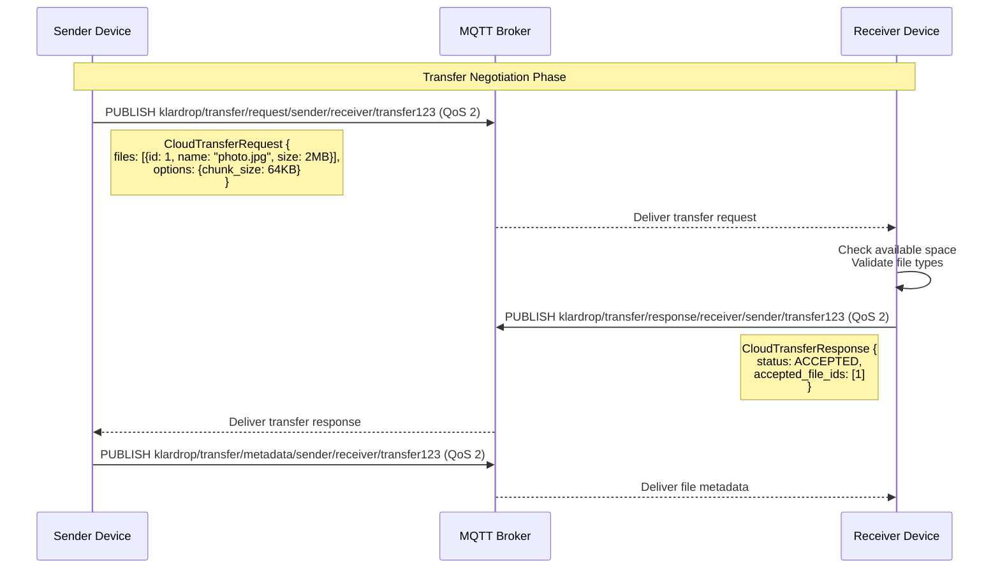
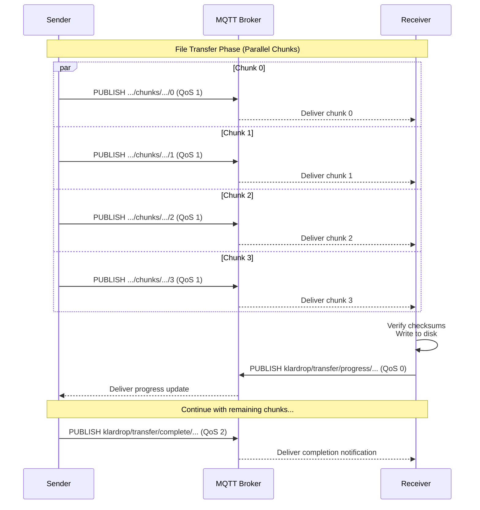
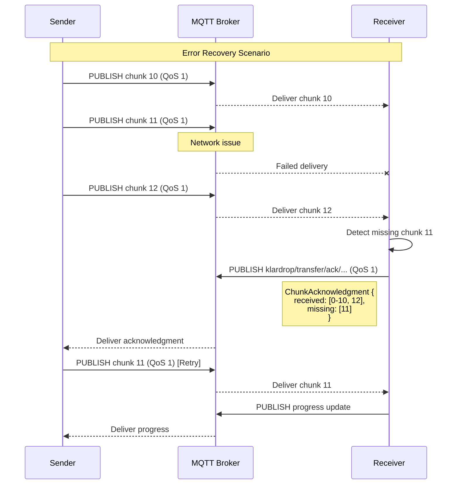
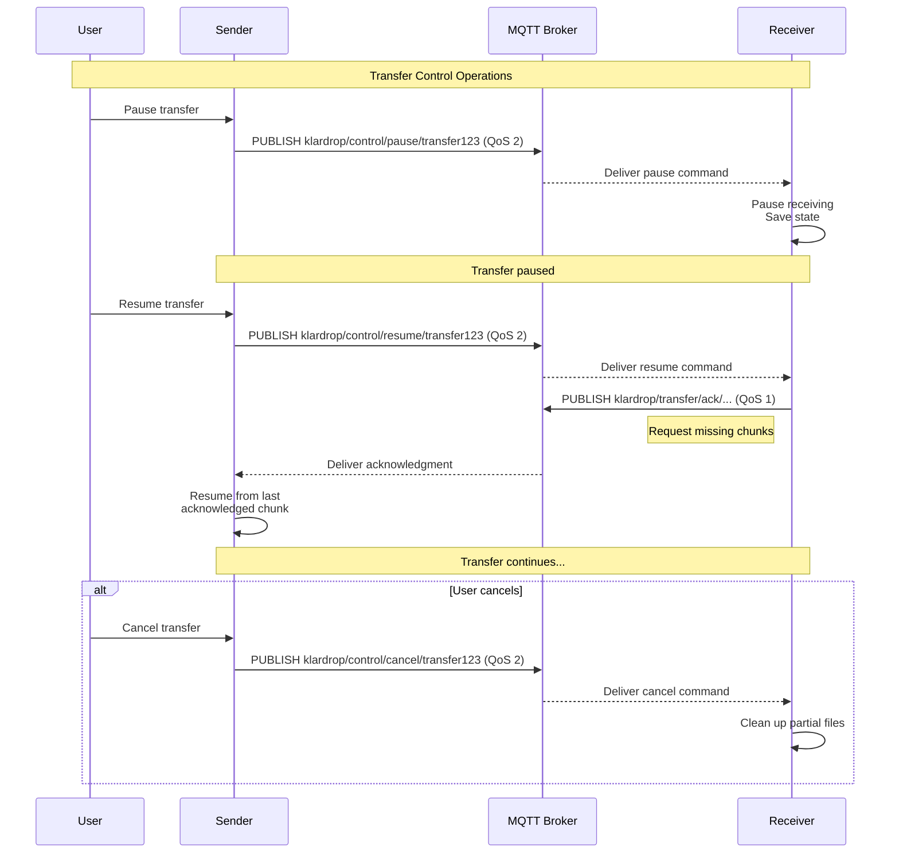
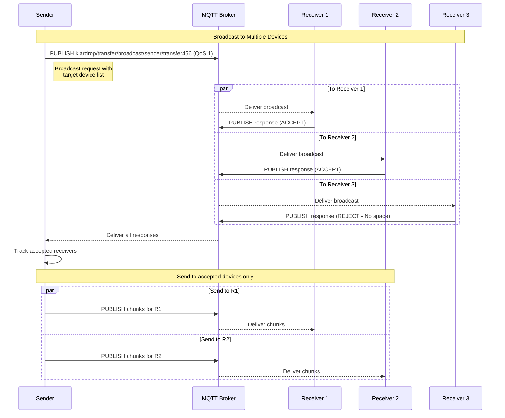
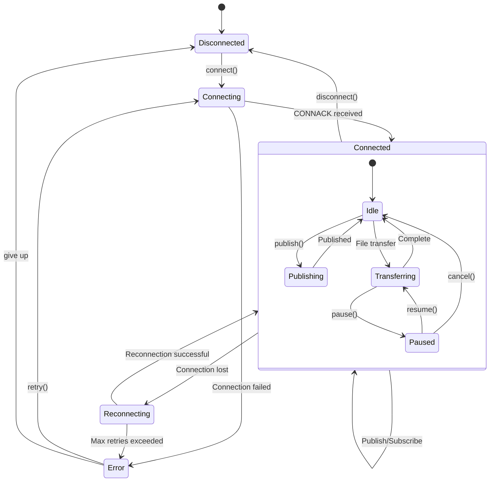
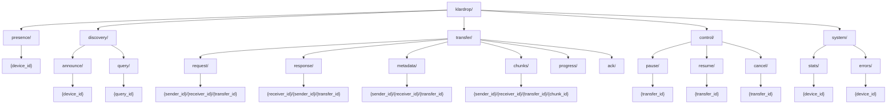
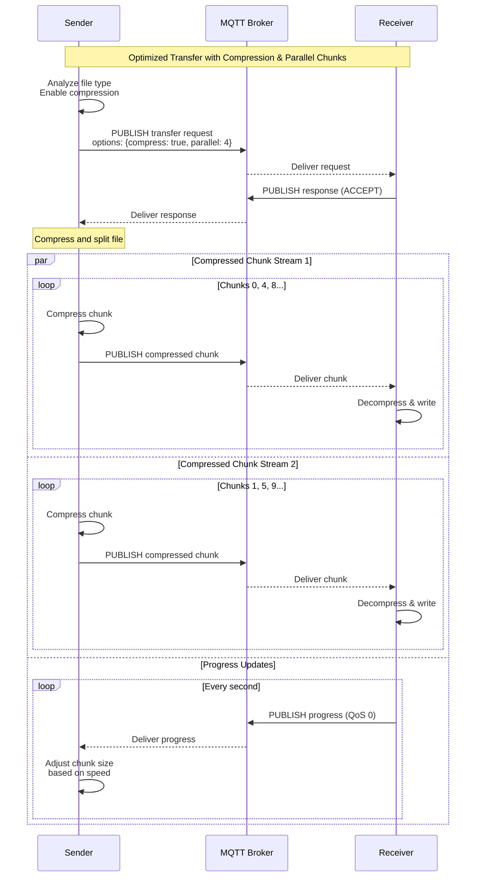

# MQTT Message Flow Diagrams

## Device Discovery Flow

## File Transfer Negotiation Flow

## Chunked File Transfer Flow

## Error Handling and Recovery Flow

## Transfer Control Flow

## Multi-Device Broadcast Flow

## Connection State Management

## Topic Hierarchy Visualization

## Performance Optimization Flow

## Notes on Message Flow

### QoS Level Usage
- **QoS 0** (At most once): Used for presence updates and progress reports where occasional loss is acceptable
- **QoS 1** (At least once): Used for file chunks where retransmission is handled at application level
- **QoS 2** (Exactly once): Used for critical control messages like transfer requests/responses

### Optimization Strategies
1. **Parallel Chunk Transmission**: Multiple chunks sent simultaneously to maximize bandwidth
2. **Adaptive Chunk Size**: Adjust based on network conditions
3. **Compression**: Automatic for text/compressible files
4. **Topic Aliases**: Reduce overhead for frequently used topics
5. **Shared Subscriptions**: Load balance across multiple client instances

### Error Recovery
- Automatic reconnection with exponential backoff
- Chunk-level acknowledgments for reliable transfer
- Resume capability from last successful chunk
- Timeout handling for stale transfers