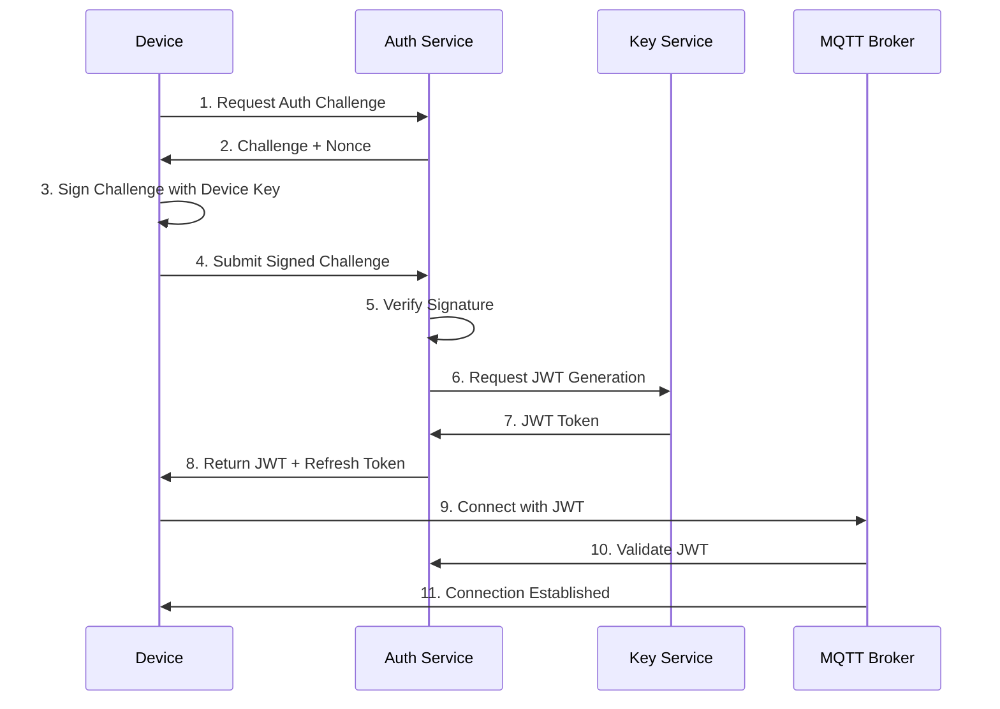

# Klardrop Cloud Transfer Security Model

## Table of Contents
1. [Overview](#overview)
2. [Architecture Overview](#architecture-overview)
3. [Authentication System](#authentication-system)
4. [Device Management](#device-management)
5. [Encryption Scheme](#encryption-scheme)
6. [MQTT Broker Security](#mqtt-broker-security)
7. [Key Management](#key-management)
8. [Security Protocols](#security-protocols)
9. [Attack Protection](#attack-protection)
10. [Privacy Considerations](#privacy-considerations)
11. [Implementation Guide](#implementation-guide)

## Overview

This document describes a comprehensive security model for Klardrop's cloud transfer system, enabling secure file transfers between devices through an MQTT broker when direct peer-to-peer connections are not available.

### Design Principles
- **Zero-Trust Architecture**: No implicit trust between components
- **End-to-End Encryption**: Data encrypted from source to destination
- **Perfect Forward Secrecy**: Compromise of long-term keys doesn't compromise past sessions
- **Defense in Depth**: Multiple layers of security
- **Privacy by Design**: Minimal metadata exposure

## Architecture Overview

```
┌─────────────────┐         ┌─────────────────┐         ┌─────────────────┐
│   Device A      │         │  Cloud Services │         │   Device B      │
├─────────────────┤         ├─────────────────┤         ├─────────────────┤
│ Klardrop Client │◄──TLS──►│  Auth Service   │◄──TLS──►│ Klardrop Client │
│                 │         │                 │         │                 │
│ Security Module │◄──TLS──►│  MQTT Broker    │◄──TLS──►│ Security Module │
│                 │         │                 │         │                 │
│ Key Store       │         │  Key Service    │         │ Key Store       │
└─────────────────┘         └─────────────────┘         └─────────────────┘
        │                           │                           │
        └───────── E2E Encrypted Channel ──────────────────────┘
```

## Authentication System

### 1. Device Authentication Flow



### 2. JWT Token Structure

```kotlin
data class KlardropJWT(
    // Header
    val alg: String = "ES256",  // ECDSA with P-256
    val typ: String = "JWT",
    
    // Payload
    val sub: String,            // Device ID
    val iss: String,            // Issuer (Klardrop Auth Service)
    val aud: String,            // Audience (MQTT Broker)
    val exp: Long,              // Expiration (15 minutes)
    val iat: Long,              // Issued At
    val jti: String,            // JWT ID (for revocation)
    val deviceGroups: List<String>, // User's device groups
    val permissions: List<String>   // MQTT topic permissions
)
```

### 3. Authentication Implementation

```kotlin
interface AuthenticationService {
    suspend fun authenticate(deviceCredentials: DeviceCredentials): AuthResult
    suspend fun refreshToken(refreshToken: String): AuthResult
    suspend fun validateToken(jwt: String): TokenValidation
    suspend fun revokeToken(jwt: String)
}

data class DeviceCredentials(
    val deviceId: String,
    val deviceKey: ByteArray,  // ECDSA private key
    val challenge: String,
    val signature: ByteArray
)

data class AuthResult(
    val accessToken: String,   // JWT
    val refreshToken: String,  // Long-lived refresh token
    val expiresIn: Long,       // Seconds until expiration
    val mqttClientId: String,  // Unique MQTT client ID
    val mqttTopics: List<String> // Authorized topics
)
```

## Device Management

### 1. User Account and Device Grouping

```kotlin
data class UserAccount(
    val userId: String,
    val email: String,
    val createdAt: Long,
    val deviceGroups: List<DeviceGroup>
)

data class DeviceGroup(
    val groupId: String,
    val groupName: String,
    val devices: List<RegisteredDevice>,
    val sharedKey: ByteArray  // Group shared encryption key
)

data class RegisteredDevice(
    val deviceId: String,
    val deviceName: String,
    val deviceType: DeviceType,
    val publicKey: ByteArray,  // ECDSA public key
    val certificateFingerprint: String,
    val addedAt: Long,
    val lastSeen: Long,
    val trustLevel: TrustLevel
)

enum class TrustLevel {
    VERIFIED,      // Manually verified by user
    TRUSTED,       // Added by trusted device
    PENDING,       // Awaiting verification
    REVOKED        // No longer trusted
}
```

### 2. Device Registration Flow

```kotlin
interface DeviceRegistrationService {
    suspend fun generateDeviceKeyPair(): DeviceKeyPair
    suspend fun registerDevice(
        userToken: String,
        deviceInfo: DeviceInfo,
        publicKey: ByteArray
    ): RegistrationResult
    
    suspend fun verifyDevice(
        deviceId: String,
        verificationCode: String
    ): Boolean
    
    suspend fun addDeviceToGroup(
        deviceId: String,
        groupId: String,
        addedBy: String  // Device ID that's adding
    )
}
```

## Encryption Scheme

### 1. Multi-Layer Encryption Architecture

```
Application Layer:  [File Data]
                         ↓
E2E Encryption:    [Encrypted with Recipient Key]
                         ↓
Group Encryption:  [Encrypted with Group Key]
                         ↓
Transport Layer:   [TLS 1.3 Encryption]
                         ↓
Network Layer:     [MQTT Protocol]
```

### 2. End-to-End Encryption Protocol

```kotlin
interface E2EEncryption {
    // Key exchange using ECDH
    suspend fun performKeyExchange(
        localPrivateKey: ByteArray,
        remotePublicKey: ByteArray
    ): SharedSecret
    
    // Encrypt file with AES-256-GCM
    suspend fun encryptFile(
        file: PlatformFile,
        sharedSecret: SharedSecret,
        metadata: FileMetadata
    ): EncryptedFile
    
    // Decrypt file
    suspend fun decryptFile(
        encryptedFile: EncryptedFile,
        sharedSecret: SharedSecret
    ): PlatformFile
}

data class EncryptedFile(
    val encryptedData: ByteArray,
    val nonce: ByteArray,          // 12 bytes for GCM
    val authTag: ByteArray,        // 16 bytes
    val ephemeralPublicKey: ByteArray, // For forward secrecy
    val metadata: EncryptedMetadata
)

data class EncryptedMetadata(
    val algorithm: String = "AES-256-GCM",
    val keyDerivation: String = "HKDF-SHA256",
    val compressionType: String?,
    val originalSize: Long,
    val checksum: ByteArray        // SHA-256 of original file
)
```

### 3. Chunk-Based Streaming Encryption

```kotlin
class StreamingEncryption {
    suspend fun encryptStream(
        inputStream: Source,
        outputChannel: ByteWriteChannel,
        key: ByteArray,
        onProgress: (Long, Long) -> Unit
    ) {
        val cipher = AesGcmCipher(key)
        val chunkSize = 1024 * 1024  // 1MB chunks
        var chunkIndex = 0L
        var totalProcessed = 0L
        
        inputStream.buffered().use { buffer ->
            while (!buffer.exhausted()) {
                val chunk = buffer.readByteArray(chunkSize)
                val nonce = deriveChunkNonce(key, chunkIndex)
                
                val encryptedChunk = cipher.encrypt(chunk, nonce)
                outputChannel.writeChunkHeader(chunkIndex, encryptedChunk.size)
                outputChannel.writeFully(encryptedChunk)
                
                totalProcessed += chunk.size
                onProgress(totalProcessed, inputStream.size)
                chunkIndex++
            }
        }
    }
}
```

## MQTT Broker Security

### 1. Broker Configuration

```yaml
# MQTT Broker Security Configuration
listeners:
  - port: 8883
    protocol: mqtts
    tls:
      version: "1.3"
      cipher_suites:
        - TLS_AES_256_GCM_SHA384
        - TLS_CHACHA20_POLY1305_SHA256
      certificate: /certs/broker.crt
      private_key: /certs/broker.key
      ca_certificate: /certs/ca.crt
      verify_peer: true

authentication:
  - type: jwt
    jwks_url: https://auth.klardrop.com/.well-known/jwks.json
    audience: mqtt.klardrop.com
    
authorization:
  type: dynamic
  cache_ttl: 300
  rules:
    - pattern: "klardrop/+/+/transfer/#"
      permission: "device:transfer"
    - pattern: "klardrop/+/+/presence"
      permission: "device:presence"
```

### 2. Topic Structure and ACL

```kotlin
object MqttTopics {
    // Device presence
    fun devicePresence(deviceId: String) = 
        "klardrop/devices/$deviceId/presence"
    
    // Transfer negotiation
    fun transferRequest(fromDevice: String, toDevice: String) = 
        "klardrop/transfer/$fromDevice/$toDevice/request"
    
    // Transfer data chunks
    fun transferData(sessionId: String) = 
        "klardrop/transfer/session/$sessionId/data"
    
    // Control messages
    fun controlChannel(deviceId: String) = 
        "klardrop/devices/$deviceId/control"
}

class MqttAuthorization {
    fun canPublish(clientId: String, topic: String, jwt: JWT): Boolean {
        return when {
            topic.startsWith("klardrop/devices/$clientId/") -> true
            topic.startsWith("klardrop/transfer/$clientId/") -> true
            topic.contains("/session/") -> {
                val sessionId = extractSessionId(topic)
                isAuthorizedForSession(clientId, sessionId, jwt)
            }
            else -> false
        }
    }
}
```

### 3. Connection Security

```kotlin
class SecureMqttClient {
    private val sslContext = createTLSContext()
    
    suspend fun connect(
        broker: String,
        jwt: String,
        deviceId: String
    ): MqttConnection {
        val options = MqttConnectOptions().apply {
            isCleanSession = false
            keepAliveInterval = 60
            connectionTimeout = 30
            
            // TLS Configuration
            socketFactory = sslContext.socketFactory
            isHttpsHostnameVerificationEnabled = true
            
            // Authentication
            userName = deviceId
            password = jwt.toCharArray()
            
            // Will message for presence
            setWill(
                MqttTopics.devicePresence(deviceId),
                """{"status":"offline","timestamp":${System.currentTimeMillis()}}""".toByteArray(),
                2,  // QoS 2
                true // Retained
            )
        }
        
        return MqttConnection(broker, options)
    }
}
```

## Key Management

### 1. Key Hierarchy

```
Master Key (Hardware-backed)
    ├── Device Identity Key (ECDSA P-256)
    ├── Encryption Key Derivation Key
    │   ├── File Encryption Keys (Per-session)
    │   └── Metadata Encryption Keys
    └── MQTT TLS Client Certificate Key
```

### 2. Key Derivation and Storage

```kotlin
interface KeyManagementService {
    // Generate device master key (stored in hardware keystore if available)
    suspend fun generateMasterKey(): MasterKey
    
    // Derive keys using HKDF
    suspend fun deriveKey(
        masterKey: MasterKey,
        purpose: KeyPurpose,
        context: ByteArray
    ): DerivedKey
    
    // Key rotation
    suspend fun rotateKeys(
        oldMasterKey: MasterKey,
        preserveIdentity: Boolean
    ): KeyRotationResult
    
    // Secure key storage
    suspend fun storeKey(
        keyId: String,
        key: ByteArray,
        protection: KeyProtection
    )
}

enum class KeyPurpose {
    DEVICE_IDENTITY,
    FILE_ENCRYPTION,
    MQTT_CLIENT_AUTH,
    GROUP_ENCRYPTION
}

enum class KeyProtection {
    HARDWARE_BACKED,    // TPM/Secure Enclave
    SOFTWARE_AES,       // Software encryption
    PLATFORM_KEYCHAIN   // OS keychain
}
```

### 3. Session Key Exchange Protocol

```kotlin
class SessionKeyExchange {
    suspend fun initiateExchange(
        localDevice: DeviceIdentity,
        remoteDevice: RegisteredDevice
    ): KeyExchangeSession {
        // Generate ephemeral ECDH key pair
        val ephemeralKeyPair = generateEphemeralKeyPair()
        
        // Create key exchange request
        val request = KeyExchangeRequest(
            initiatorId = localDevice.deviceId,
            ephemeralPublicKey = ephemeralKeyPair.public,
            timestamp = System.currentTimeMillis(),
            signature = signRequest(ephemeralKeyPair.public, localDevice.privateKey)
        )
        
        // Send via MQTT
        publishKeyExchange(remoteDevice.deviceId, request)
        
        return KeyExchangeSession(
            sessionId = generateSessionId(),
            localEphemeral = ephemeralKeyPair,
            remoteDevice = remoteDevice,
            state = KeyExchangeState.INITIATED
        )
    }
    
    suspend fun completeExchange(
        session: KeyExchangeSession,
        response: KeyExchangeResponse
    ): SharedSecret {
        // Verify response signature
        verifySignature(
            response.ephemeralPublicKey,
            response.signature,
            session.remoteDevice.publicKey
        )
        
        // Perform ECDH
        val sharedSecret = performECDH(
            session.localEphemeral.private,
            response.ephemeralPublicKey
        )
        
        // Derive session keys
        return deriveSessionKeys(
            sharedSecret,
            session.sessionId,
            "klardrop-file-transfer"
        )
    }
}
```

## Security Protocols

### 1. Secure File Transfer Protocol

```kotlin
class SecureFileTransferProtocol {
    suspend fun initiateTransfer(
        file: PlatformFile,
        recipient: RegisteredDevice,
        transferOptions: TransferOptions
    ): TransferSession {
        // 1. Establish session keys
        val keyExchange = SessionKeyExchange()
        val session = keyExchange.initiateExchange(localDevice, recipient)
        
        // 2. Create transfer metadata
        val metadata = TransferMetadata(
            fileId = generateFileId(),
            fileName = file.name,
            fileSize = file.size(),
            mimeType = file.mimeType,
            checksum = calculateChecksum(file),
            chunksCount = calculateChunks(file.size()),
            compressionType = transferOptions.compression
        )
        
        // 3. Encrypt metadata
        val encryptedMetadata = encryptMetadata(metadata, session.metadataKey)
        
        // 4. Publish transfer request
        publishTransferRequest(recipient.deviceId, encryptedMetadata)
        
        return TransferSession(
            sessionId = session.sessionId,
            file = file,
            recipient = recipient,
            metadata = metadata,
            encryptionKey = session.fileKey,
            state = TransferState.INITIATED
        )
    }
    
    suspend fun sendFile(session: TransferSession) {
        val chunker = FileChunker(session.file, CHUNK_SIZE)
        
        chunker.chunks().collectIndexed { index, chunk ->
            // Encrypt chunk
            val encryptedChunk = encryptChunk(
                chunk,
                session.encryptionKey,
                index
            )
            
            // Create chunk message
            val message = ChunkMessage(
                sessionId = session.sessionId,
                chunkIndex = index,
                totalChunks = session.metadata.chunksCount,
                data = encryptedChunk,
                checksum = calculateChunkChecksum(chunk)
            )
            
            // Publish to MQTT
            publishChunk(session.sessionId, message)
            
            // Update progress
            updateProgress(index, session.metadata.chunksCount)
        }
    }
}
```

### 2. Device Pairing Protocol

```kotlin
class DevicePairingProtocol {
    suspend fun initiatePairing(
        targetDevice: DiscoveredDevice,
        pairingMethod: PairingMethod
    ): PairingSession {
        return when (pairingMethod) {
            PairingMethod.QR_CODE -> initiateQRPairing(targetDevice)
            PairingMethod.NUMERIC_CODE -> initiateNumericPairing(targetDevice)
            PairingMethod.PROXIMITY -> initiateProximityPairing(targetDevice)
        }
    }
    
    private suspend fun initiateQRPairing(
        targetDevice: DiscoveredDevice
    ): PairingSession {
        // Generate pairing secret
        val pairingSecret = generatePairingSecret()
        
        // Create QR data
        val qrData = QRPairingData(
            deviceId = localDevice.deviceId,
            publicKey = localDevice.publicKey,
            pairingSecret = pairingSecret,
            timestamp = System.currentTimeMillis(),
            expiresIn = 300 // 5 minutes
        )
        
        // Display QR code
        displayQRCode(qrData)
        
        return PairingSession(
            sessionId = generateSessionId(),
            targetDevice = targetDevice,
            method = PairingMethod.QR_CODE,
            secret = pairingSecret,
            state = PairingState.WAITING_CONFIRMATION
        )
    }
    
    suspend fun completePairing(
        session: PairingSession,
        confirmation: PairingConfirmation
    ): PairingResult {
        // Verify pairing secret
        if (!verifyPairingSecret(confirmation.secret, session.secret)) {
            throw SecurityException("Invalid pairing secret")
        }
        
        // Exchange certificates
        val certificates = exchangeCertificates(
            session.targetDevice,
            localDevice.certificate
        )
        
        // Add to trusted devices
        addTrustedDevice(
            deviceId = session.targetDevice.deviceId,
            certificate = certificates.remote,
            trustLevel = TrustLevel.VERIFIED
        )
        
        return PairingResult(
            success = true,
            pairedDevice = session.targetDevice,
            sharedGroupKey = generateGroupKey()
        )
    }
}
```

## Attack Protection

### 1. Protection Mechanisms

```kotlin
class SecurityMonitor {
    // Rate limiting
    private val rateLimiter = RateLimiter(
        maxRequests = 100,
        windowSeconds = 60
    )
    
    // Replay attack protection
    private val nonceCache = ExpiringCache<String>(
        ttlSeconds = 300
    )
    
    suspend fun validateRequest(
        request: SecureRequest,
        clientId: String
    ): ValidationResult {
        // Check rate limits
        if (!rateLimiter.allowRequest(clientId)) {
            return ValidationResult.RateLimited
        }
        
        // Verify timestamp (prevent replay attacks)
        val timeDiff = abs(System.currentTimeMillis() - request.timestamp)
        if (timeDiff > MAX_TIME_DRIFT) {
            return ValidationResult.InvalidTimestamp
        }
        
        // Check nonce uniqueness
        if (nonceCache.contains(request.nonce)) {
            return ValidationResult.DuplicateNonce
        }
        nonceCache.put(request.nonce)
        
        // Verify signature
        if (!verifySignature(request)) {
            return ValidationResult.InvalidSignature
        }
        
        return ValidationResult.Valid
    }
}
```

### 2. MITM Protection

```kotlin
class MITMProtection {
    // Certificate pinning
    suspend fun validateServerCertificate(
        certificate: X509Certificate,
        hostname: String
    ): Boolean {
        // Check certificate pinning
        val pinnedCerts = getPinnedCertificates(hostname)
        val certFingerprint = calculateFingerprint(certificate)
        
        if (!pinnedCerts.contains(certFingerprint)) {
            logSecurityEvent("Certificate pinning failed", hostname)
            return false
        }
        
        // Verify certificate chain
        return verifyCertificateChain(certificate)
    }
    
    // Channel binding
    suspend fun createChannelBinding(
        tlsSession: TLSSession
    ): ChannelBinding {
        return ChannelBinding(
            tlsUnique = tlsSession.getFinishedMessage(),
            tlsServerEndPoint = tlsSession.getServerCertificate().encoded
        )
    }
}
```

## Privacy Considerations

### 1. Metadata Protection

```kotlin
class MetadataProtection {
    // Minimize metadata exposure
    fun protectTransferMetadata(
        metadata: TransferMetadata
    ): ProtectedMetadata {
        return ProtectedMetadata(
            // Only expose necessary fields
            transferId = metadata.transferId,
            encryptedSize = encryptSize(metadata.fileSize),
            // Hide filename, type, etc.
            encryptedDetails = encryptMetadata(metadata)
        )
    }
    
    // Anonymous device discovery
    fun generateAnonymousAdvertisement(
        device: DeviceInfo
    ): AnonymousAdvertisement {
        // Use rotating identifiers
        val rotatingId = generateRotatingId(device.deviceId)
        
        return AnonymousAdvertisement(
            temporaryId = rotatingId,
            capabilities = device.capabilities,
            // No personally identifiable information
            timestamp = roundToNearestMinute(System.currentTimeMillis())
        )
    }
}
```

### 2. Traffic Analysis Protection

```kotlin
class TrafficAnalysisProtection {
    // Padding to hide message sizes
    fun padMessage(
        message: ByteArray,
        paddingStrategy: PaddingStrategy
    ): ByteArray {
        return when (paddingStrategy) {
            PaddingStrategy.FIXED -> padToFixedSize(message, 1024)
            PaddingStrategy.RANDOM -> padWithRandom(message, 100..500)
            PaddingStrategy.EXPONENTIAL -> padToExponential(message)
        }
    }
    
    // Dummy traffic generation
    suspend fun generateDummyTraffic(
        connection: MqttConnection,
        profile: TrafficProfile
    ) {
        coroutineScope {
            launch {
                while (isActive) {
                    delay(profile.randomInterval())
                    sendDummyMessage(connection, profile.messageSize())
                }
            }
        }
    }
}
```

## Implementation Guide

### 1. Security Module Structure

```kotlin
// Main security module
class KlardropSecurityModule(
    private val platformDependencies: SecurityPlatformDependencies,
    private val config: SecurityConfig
) {
    val authentication = AuthenticationService(config.authEndpoint)
    val encryption = EncryptionService(platformDependencies.cryptoProvider)
    val keyManager = KeyManagementService(platformDependencies.keyStore)
    val deviceManager = DeviceManagementService()
    val securityMonitor = SecurityMonitor()
    
    suspend fun initialize() {
        // Initialize master keys
        keyManager.initializeMasterKey()
        
        // Load device certificate
        deviceManager.loadOrGenerateCertificate()
        
        // Start security monitoring
        securityMonitor.startMonitoring()
    }
}

// Platform-specific dependencies
interface SecurityPlatformDependencies {
    val keyStore: PlatformKeyStore
    val cryptoProvider: CryptoProvider
    val certificateManager: CertificateManager
    val secureRandom: SecureRandom
}

// Integration with existing Klardrop
class SecureCloudTransferExtension(
    private val security: KlardropSecurityModule,
    private val mqttClient: SecureMqttClient
) : TransferExtension {
    override suspend fun transferFile(
        file: PlatformFile,
        recipient: DeviceInfo
    ): TransferResult {
        // Authenticate with cloud
        val auth = security.authentication.authenticate(localDevice)
        
        // Connect to MQTT
        val connection = mqttClient.connect(
            config.mqttBroker,
            auth.accessToken,
            localDevice.deviceId
        )
        
        // Perform secure transfer
        val protocol = SecureFileTransferProtocol(security, connection)
        return protocol.initiateTransfer(file, recipient)
    }
}
```

### 2. Configuration

```kotlin
data class SecurityConfig(
    // Authentication
    val authEndpoint: String = "https://auth.klardrop.com",
    val jwtAudience: String = "mqtt.klardrop.com",
    val tokenRefreshMargin: Long = 300, // 5 minutes
    
    // Encryption
    val fileEncryption: EncryptionAlgorithm = EncryptionAlgorithm.AES_256_GCM,
    val keyExchange: KeyExchangeAlgorithm = KeyExchangeAlgorithm.ECDH_P256,
    val keyDerivation: KDFAlgorithm = KDFAlgorithm.HKDF_SHA256,
    
    // MQTT
    val mqttBroker: String = "mqtts://mqtt.klardrop.com:8883",
    val mqttQos: Int = 2,
    val mqttRetained: Boolean = false,
    
    // Security
    val certificatePinning: Boolean = true,
    val requireDeviceVerification: Boolean = true,
    val maxTransferSize: Long = 5L * 1024 * 1024 * 1024, // 5GB
    
    // Privacy
    val anonymousDiscovery: Boolean = true,
    val metadataEncryption: Boolean = true,
    val trafficPadding: Boolean = true
)
```

This security model provides comprehensive protection for Klardrop's cloud transfer system while maintaining usability and performance. The implementation follows zero-trust principles and provides multiple layers of security to protect against various attack vectors.