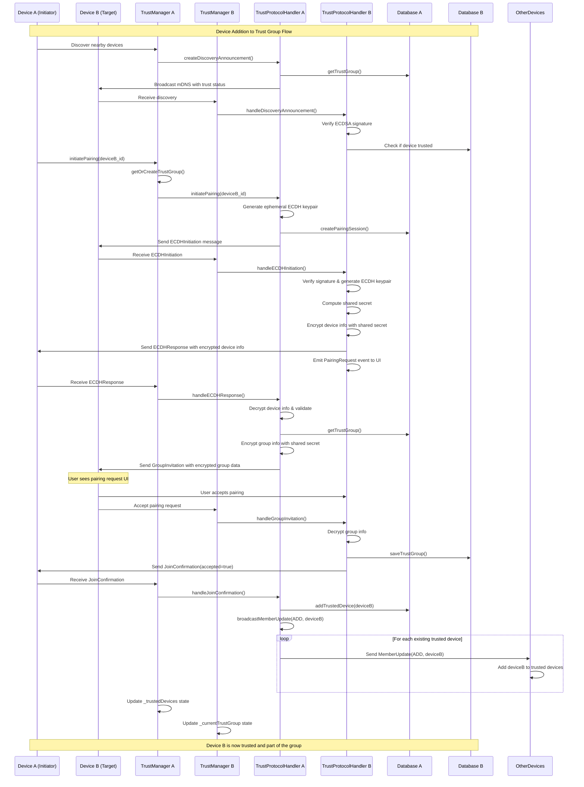

# Device Addition to Trust Group - Sequence Diagram

This document contains the Mermaid sequence diagram that visualizes the complete flow of adding a device to a trusted group in Klardrop.

## Overview

The diagram shows the interaction between two devices (A and B) and their respective trust management components during the device addition process. It illustrates the cryptographic handshake, user approval flow, and database updates.

## Sequence Diagram



## Key Components Explained

### Device A (Initiator)
- The device that starts the pairing process
- Must have an existing trust group or creates one
- Orchestrates the cryptographic handshake

### Device B (Target)
- The device being invited to join the trust group
- User must approve the pairing request
- Receives and stores the complete trust group information

### TrustManager
- Central coordinator for trust-related functionality
- Manages device identity and trust group state
- Handles high-level pairing orchestration

### TrustProtocolHandler
- Implements the cryptographic protocol
- Handles message serialization/deserialization
- Manages ephemeral keys and security validation

### Database
- Stores trust groups, trusted devices, and pairing sessions
- Maintains audit trail of security events
- Ensures data consistency and integrity

## Protocol Messages

### ECDHInitiation
```protobuf
message ECDHInitiation {
  string session_id = 1;
  string device_id = 2;
  bytes ephemeral_public_key = 3;
  bytes encrypted_group_id = 4;
  int64 timestamp = 5;
  bytes nonce = 6;
  bytes signature = 7;
}
```

### ECDHResponse
```protobuf
message ECDHResponse {
  string session_id = 1;
  string device_id = 2;
  bytes ephemeral_public_key = 3;
  bytes encrypted_device_info = 4;
  int64 timestamp = 5;
  bytes signature = 6;
}
```

### GroupInvitation
```protobuf
message GroupInvitation {
  string session_id = 1;
  bytes encrypted_payload = 2;  // Contains GroupInfo
  bytes signature = 3;
}
```

### JoinConfirmation
```protobuf
message JoinConfirmation {
  string session_id = 1;
  string device_id = 2;
  bool accepted = 3;
  int64 timestamp = 4;
  bytes signature = 5;
}
```

### MemberUpdate
```protobuf
message MemberUpdate {
  string group_id = 1;
  UpdateAction action = 2;  // ADD, REMOVE, UPDATE
  TrustedDevice device = 3;
  int32 version = 4;
  int64 timestamp = 5;
  bytes signature = 6;
}
```

## Security Guarantees

### Forward Secrecy
- Ephemeral ECDH keys are generated for each pairing session
- Keys are discarded after use
- Past communications remain secure even if long-term keys are compromised

### Authentication
- All messages are signed with ECDSA using device private keys
- Signatures prevent impersonation and message tampering
- Public key verification ensures message authenticity

### Confidentiality
- Group information is encrypted with AES-GCM
- Shared secrets derived using HKDF
- Different keys used for different protocol phases

### Integrity
- Message authentication codes prevent tampering
- Database constraints ensure data consistency
- Audit trail maintains security event history

## Error Scenarios

### Network Failures
- Messages may be lost or delayed
- Pairing sessions have built-in timeouts (5 minutes)
- Failed sessions are cleaned up automatically

### User Rejection
- Device B user can decline the pairing request
- Session is marked as REJECTED and cleaned up
- Device A is notified of the rejection

### Cryptographic Failures
- Invalid signatures cause message rejection
- Decryption failures abort the pairing process
- Security events are logged for analysis

### Database Conflicts
- Concurrent operations use transactions
- Foreign key constraints maintain referential integrity
- Upsert operations handle race conditions

## Performance Characteristics

### Message Overhead
- Discovery announcements: ~200 bytes
- ECDH messages: ~500-1000 bytes  
- Group invitations: Variable based on group size
- Member updates: ~300-500 bytes

### Timing
- Discovery: Continuous broadcast (every 30 seconds)
- Pairing initiation: Immediate
- ECDH handshake: ~100-200ms per message
- Database operations: ~10-50ms per query
- Total pairing time: ~2-5 seconds

### Resource Usage
- Ephemeral key generation: ~50-100ms
- ECDH computation: ~20-50ms
- AES-GCM encryption: ~1-10ms
- Database writes: ~5-20ms

This diagram and documentation provide a comprehensive view of the device addition process, enabling developers to understand, review, and maintain the trusted group functionality.